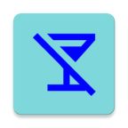
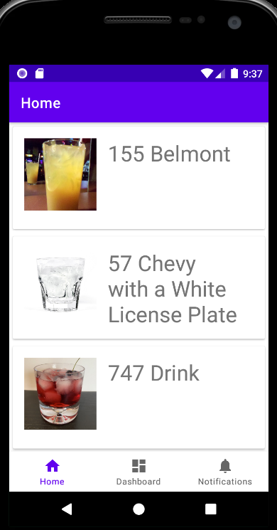
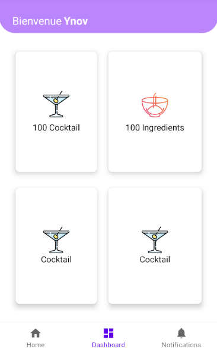
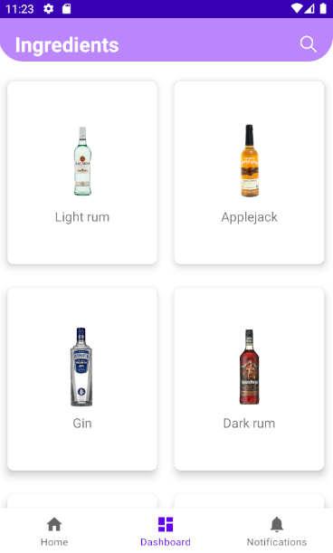
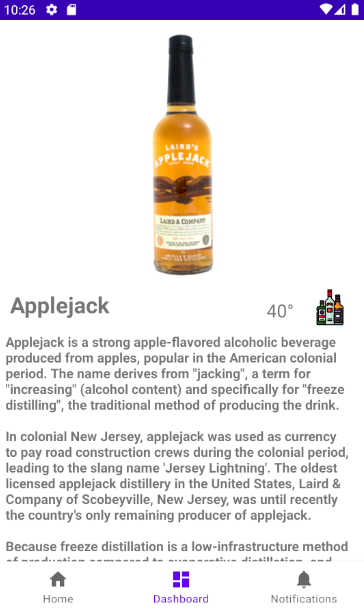
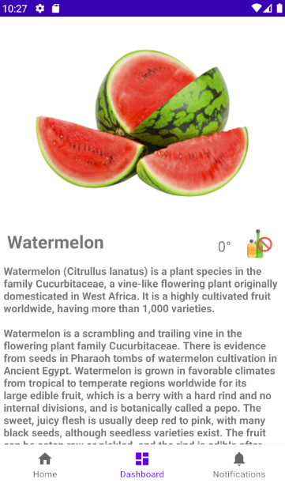

# CocktailApp

## Informations utiles
* Lien [API publique](https://www.thecocktaildb.com/api.php)

## Description
Application Mobile qui permets de référencer tous les Cocktails avec les ingrédients nécessaire pour leurs réalisations. De plus l'application pourra effectuer des statistiques visible par l'utilisateur pour qu'il sache quels sont les cocktails qui a le plus aimé.

## Roadmap
* Voir les [Open issues](https://github.com/gpatruno/CocktailApp/issues)

## Les Vues

##Dashboard

## Ingredients view

## Ingredient detail view

By G.PATRUNO & B.PEN
