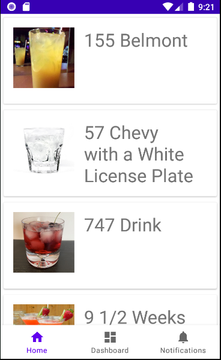
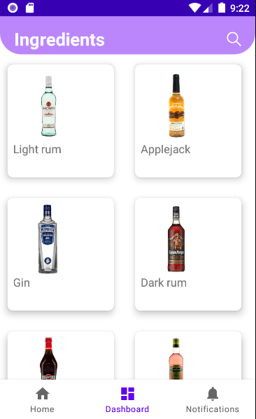

# CocktailApp

## Informations utiles
* Lien [API publique](https://www.thecocktaildb.com/api.php)

## Description
Application Mobile qui permets de référencer tous les Cocktails avec les ingrédients nécessaire pour leurs réalisations. De plus l'application pourra effectuer des statistiques visible par l'utilisateur pour qu'il sache quels sont les cocktails qui a le plus aimé.

## Roadmap
* Voir les [Open issues](https://github.com/gpatruno/CocktailApp/issues)

## Les Vues
- Vue Principale

- Vue Cocktail detail

- Vue Liste des ingrédients

## Wiki 

- Documentation implémentation Room
https://developer.android.com/training/data-storage/room

By G.PATRUNO & B.PEN
